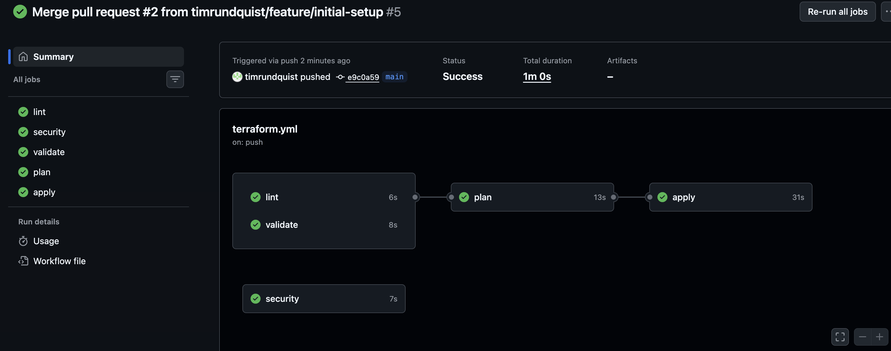
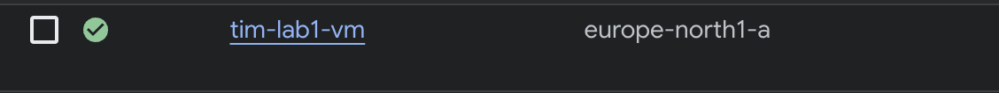

# lab1-terraform
Terraform lab

Vad projektet gör
Detta prjektet går ut på att man med hjälp av terraform ska skapa en Linux VM i Google cloud Platform (GCP). Linux VM:n är konfiguererad med basic hårdning, konfigurationen sker genom ett startup script som installerar fail2ban, brandvägg och auto säkerhetsuppdateringar. I projektet visar man också användningen av Github Actions pipeline för säkerhetsskanning, linting och terraform validation, och även en backup plan.

Hur man kör
1. Först klonar man repot och ser till så att man är i korrekt mapp

2. Andra steget är att initiera terraform: terrform init

3. Kolla planen med: terraform plan

4. Och till sis applicerar man konfigurationen med: terraform apply

Screenshots

##Screenshot av pipeline med lint, security, validate

##Screenshot av VM i GCP konsolen.

Säkerhetsbeslut

UFW (Uncomplicated firewall): Denna brandväggen tillåter SSH, men blockerar resten av all trafike
Fail2Ban: är ett skydd som förhindrar brute-force attacker på SSH.
Unattended-Upgrades: Gör säkerhetsuppdateringar automatiskt på VM:n

De här säkerhets åtgärderna ser till så VM:n har grundläggande hårdning 
